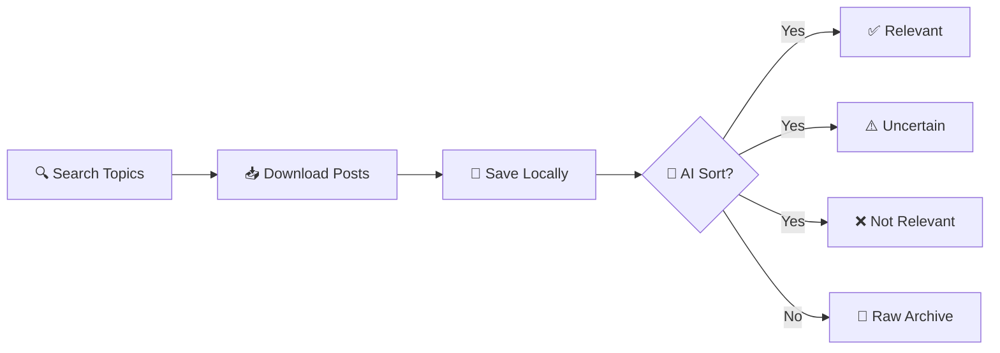

<div align="center">

# 🎬 Threads Content Collector

### *Your Personal Disney & Hobby Archive*

[](https://www.python.org/downloads/)
[](LICENSE)
[](.)

[🌏 繁體中文](README.zh.md) | **English** | [📚 Documentation Portal](#-documentation)

> *Collect, organize, and archive your favorite Threads posts about Disney, Zootopia, recipes, and more!*

</div>

---

## ✨ What Is This?

A **hobby archival toolkit** for Disney fans and content collectors! If you love Zootopia characters, animation discussions, themed recipes, or fan communities, this helps you:

- 🔍 **Search & Save** - Find posts about Judy Hopps, Nick Wilde, and your favorite topics
- 🤖 **AI Organization** - Smart sorting helps identify the best matches for your collection
- 💾 **Local Archive** - Everything saved privately on your computer
- 🎨 **Media Included** - Downloads photos, videos, and attachments automatically

---

## 🎯 Perfect For

| Interest | Examples |
|----------|----------|
| 🦊 **Disney Characters** | Zootopia, Judy Hopps, Nick Wilde, character analysis |
| 🎨 **Fan Content** | Cosplay builds, fan art, creative projects |
| 🍳 **Themed Recipes** | Pawpsicles, Disney-inspired treats, park food recreations |
| 🎬 **Animation** | Behind-the-scenes, technique discussions, industry news |
| 🏰 **Parks & Merch** | Disney experiences, collectibles, attraction updates |

---

## 📰 Recent Updates

<details open>
<summary><b>🚀 Version 1.0 - December 2025</b></summary>

- ✅ **Smart AI Classifier** - Local LLM integration for intelligent content sorting
- ✅ **GPU Acceleration** - Multi-threaded processing for bulk collections (100+ posts/min)
- ✅ **Resume Capability** - Checkpoint system lets you pause and continue anytime
- ✅ **Bilingual Support** - Interface available in English and Traditional Chinese (繁體中文)
- ✅ **Vision Analysis** - Optional image/video content verification
- ✅ **False Positive Detection** - Smart context understanding (e.g., "Judy" the person vs. character)

</details>

<details>
<summary><b>🎨 What Makes This Special</b></summary>

Unlike generic scrapers, this tool:
- **Understands context** - Knows "Nick Wilde" isn't just any Nick
- **Privacy-focused** - Everything processes locally, no cloud uploads
- **Hobby-oriented** - Designed for personal collections, not commercial use
- **Community-friendly** - Respects rate limits and platform guidelines

</details>

---

## 📚 Documentation

<table>
<tr>
<td width="50%" valign="top">

### 🚀 **Quick Start Guides**

- [**Quick Reference Card**](QUICK_REFERENCE.md)  
  *3-command setup, cheat sheet, examples*

- [**Model Setup Guide**](MODEL_SETUP_README.md)  
  *AI classifier setup in 3 steps*

- [**Setup Script**](setup_model.ps1)  
  *Automated one-click setup*

</td>
<td width="50%" valign="top">

### 📖 **Detailed Documentation**

- [**Complete Modelfile Guide**](MODELFILE_GUIDE.md)  
  *Advanced configuration, troubleshooting, optimization*

- [**Testing Suite**](test_classifier.py)  
  *12-test validation for accuracy*

- [**繁體中文版**](README.zh.md)  
  *Traditional Chinese documentation*

</td>
</tr>
</table>

---

## ⚡ Quick Start

<details>
<summary><b>Step 1: Installation (Click to expand)</b></summary>

### Prerequisites
- Python 3.8 or higher
- Threads account for authentication
- GPU recommended (optional, but 6x faster)

### Platform-Specific Setup

**🐧 Linux**
```bash
git clone https://github.com/jyusiwong/Threads-Archiver.git
cd Threads-Archiver

apt update && apt install -y libgconf-2-4 libatk1.0-0 libgbm-dev \
  libnotify-dev libgdk-pixbuf2.0-0 libnss3 libxss1 libasound2 \
  libxtst6 xdg-utils

pip install -r requirements.txt
playwright install chromium
```

**🍎 macOS**
```bash
git clone https://github.com/jyusiwong/Threads-Archiver.git
cd Threads-Archiver

xcode-select --install
pip install -r requirements.txt
playwright install chromium
```

**🪟 Windows**
```powershell
git clone https://github.com/jyusiwong/Threads-Archiver.git
cd Threads-Archiver

pip install -r requirements.txt
playwright install chromium
```

</details>

<details>
<summary><b>Step 2: Collect Your First Posts</b></summary>

### Phase 1: Search & Download
```bash
python phase1_search_download.py
```

**What happens:**
1. Opens browser for Threads login (one-time)
2. Searches for your topics (Judy Hopps, recipes, etc.)
3. Scrolls through results automatically
4. Downloads posts + media to your computer
5. Saves in organized JSONL format

**Configure your interests** in the script:
```python
TOPICS = ["Judy Hopps", "Nick Wilde", "Zootopia fan art", "Disney recipes"]
POST_LIMIT = 2000  # Max posts per topic
```

</details>

<details>
<summary><b>Step 3: AI-Powered Organization (Optional)</b></summary>

### Phase 2: Smart Sorting

**First time setup:**
```powershell
.\setup_model.ps1          # Creates AI classifier
python test_classifier.py  # Validates accuracy
```

**Run the sorter:**
```bash
python phase2_ai_prefilter.py              # Single-threaded
# OR
python phase2_ai_prefilter_multithreaded.py  # 6x faster (GPU)
```

**Results:**
- `_sorting/[topic]_posts_likely_yes.jsonl` - Matches your interests ✅
- `_sorting/[topic]_posts_uncertain.jsonl` - Review these ⚠️
- `_sorting/[topic]_posts_likely_no.jsonl` - Probably skip ❌

</details>

---

## 🎨 How It Works



### Two-Phase Workflow

| Phase | Purpose | Output |
|-------|---------|--------|
| **Phase 1** | Collection | Raw posts + media in `Interested_Event_Archive/` |
| **Phase 2** | Organization | Sorted posts in `_sorting/` by relevance |

---

## ⚙️ Configuration

### Customize Your Interests

```python
# phase1_search_download.py - What to collect
class Config:
    TOPICS = [
        "Judy Hopps",           # Zootopia character
        "Nick Wilde",           # Another favorite
        "Disney recipes",       # Themed cooking
        "Zootopia fan art"      # Creative content
    ]
    POST_LIMIT = 2000          # Posts per topic
    SCROLL_DELAY = 3           # Seconds between scrolls

# phase2_ai_prefilter.py - How to sort
class AppConfig:
    MODEL_NAME = "disney-classifier"     # AI model to use
    HIGH_CONFIDENCE = 0.7               # Threshold for "yes"
    LOW_CONFIDENCE = 0.3                # Threshold for "no"
    GPU_ACTIVE = True                   # Use GPU acceleration
```

---

## 📁 Project Structure

```
Threads-Archiver/
│
├── 📝 Core Scripts
│   ├── phase1_search_download.py          # Search & download posts
│   ├── phase2_ai_prefilter.py             # AI sorting (single-thread)
│   └── phase2_ai_prefilter_multithreaded.py  # AI sorting (parallel)
│
├── 🤖 AI Configuration
│   ├── Modelfile                          # Custom AI model definition
│   ├── setup_model.ps1                    # Automated setup script
│   └── test_classifier.py                 # Validation test suite
│
├── 📚 Documentation
│   ├── README.md                          # This file
│   ├── README.zh.md                       # 繁體中文版本
│   ├── QUICK_REFERENCE.md                 # Quick start guide
│   ├── MODEL_SETUP_README.md              # AI setup tutorial
│   └── MODELFILE_GUIDE.md                 # Advanced configuration
│
├── 💾 Data Directories
│   ├── Interested_Event_Archive/          # Your collected posts & media
│   ├── thread_sessions/                   # Login sessions (local only)
│   └── _sorting/                          # AI-organized outputs
│       ├── checkpoints/                   # Resume points
│       ├── *_posts_likely_yes.jsonl       # High relevance ✅
│       ├── *_posts_uncertain.jsonl        # Review needed ⚠️
│       └── *_posts_likely_no.jsonl        # Low relevance ❌
│
└── ⚙️ Configuration
    └── requirements.txt                   # Python dependencies
```

---

## 🌟 Use Cases

### ✅ Great For:
- 🎨 Building personal Disney character collections
- 📖 Archiving fan discussions and theories
- 🍳 Saving themed recipe posts for later
- 🎓 Learning about AI and data organization
- 💝 Creating curated content libraries for hobbies

### ❌ Not For:
- 💼 Commercial data harvesting
- 🔓 Violating privacy or platform ToS
- 📊 Large-scale analytics or research
- 💰 Any for-profit activities

---

## 🛡️ Responsible Use

This is a **personal hobby tool**. Please:

- ✅ Follow local laws and platform guidelines
- ✅ Respect content creators' rights
- ✅ Keep data private and secure
- ✅ Use for personal, non-commercial purposes
- ✅ Be mindful of rate limits and server load

---

## 🤝 Contributing

Found a bug? Have a feature idea? Contributions welcome!

1. 🍴 Fork the repository
2. 🌿 Create a feature branch (`git checkout -b feature/AmazingFeature`)
3. 💾 Commit your changes (`git commit -m 'Add some AmazingFeature'`)
4. 📤 Push to the branch (`git push origin feature/AmazingFeature`)
5. 🔃 Open a Pull Request

---

## 📄 License

**MIT License** - See [LICENSE](LICENSE) for details.

**In Short:**
- ✅ Use for personal projects
- ✅ Modify as you like
- ✅ Share with others
- ⚠️ Include original license notice
- ⚠️ No warranty provided

---

<div align="center">

### 🎬 Made with ❤️ for Disney Fans

*Collect what you love. Organize what matters. Archive your passion.*

**[⬆️ Back to Top](#-threads-content-collector)**

---

🦊 **Happy Collecting!** | 🐰 **Enjoy Your Archive!** | 🎨 **Share Your Passion!**

</div>
